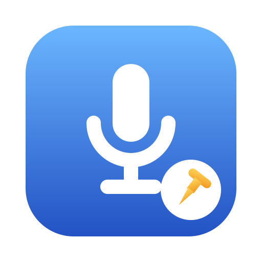
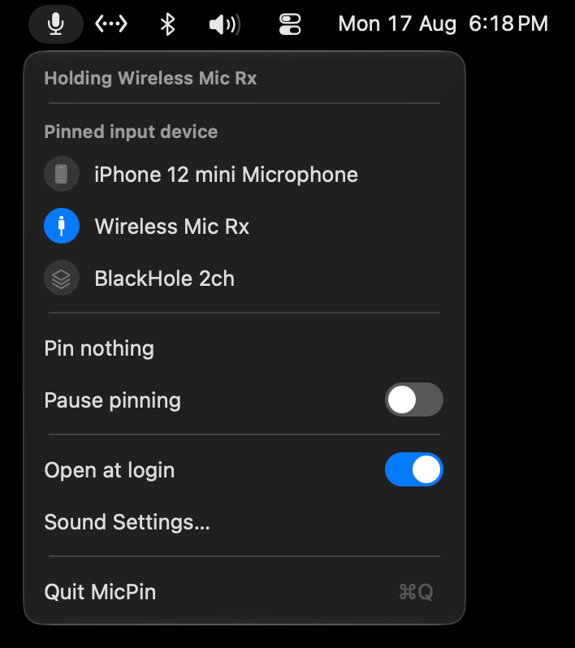

<p align="center">
  
</p>

# MicPin

A tiny macOS menubar app that keeps your chosen microphone as the default input.

macOS always switches to whatever was plugged in or paired last. Connect AirPods,
a headset or a monitor webcam and your good mic is dropped without a word —
usually noticed halfway through a call. MicPin puts it straight back.

Speakers and headphones are left alone, so you can listen on Bluetooth while a
USB or XLR mic keeps the input.

<p align="center">
  
</p>

## Install

Download the latest zip from
[**Releases**](https://github.com/IamSwap/micpin/releases), unzip it, and drag
`MicPin.app` into `/Applications`. It opens straight away, with no security
warning.

Then click the mic in the menubar, pick your microphone, and turn on
**Open at login**. That's it.

Needs macOS 13 or later. Runs on both Apple silicon and Intel.

**No permissions needed.** MicPin never records anything — it only reads and
changes which device is selected — so macOS never asks for microphone access.

## Using it

| Menu item | |
|---|---|
| *Holding …* | what it's doing right now |
| device list | pick the mic to keep — the blue badge marks it |
| Pin nothing | stop holding a mic, leave the app running |
| Pause pinning | when you actually do want a different mic |
| Open at login | start MicPin with your Mac |
| Sound Settings… | opens the Sound pane |
| Quit MicPin | ⌘Q |

Each device shows how it's connected — USB, Bluetooth, built-in, iPhone, virtual
— which is often clearer than the name.

The menubar icon shows the state: a plain mic while holding one, crossed out when
paused, and marked when your pinned mic isn't plugged in. If it's unplugged
MicPin steps aside and lets macOS choose, then takes over again when it's back.

**One thing to know:** Zoom, Teams and Google Meet remember their own microphone
separately from the system one. MicPin can't reach those, so if one is set to the
wrong mic, change it once inside that app.

## How it works

MicPin listens for CoreAudio notifications
(`kAudioHardwarePropertyDefaultInputDevice` and `kAudioHardwarePropertyDevices`)
rather than polling, so it costs nothing while idle and reacts in the same run
loop turn as the change — fast enough that an app opening the mic never sees the
wrong device.

macOS sometimes sets the default input a beat *after* announcing a device change,
overwriting what was just set, so each event is re-checked at 0.4s, 1.0s and
2.5s. Waking from sleep re-checks too.

Your choice is stored by CoreAudio UID, falling back to the device name. A USB
device's UID includes the port it's plugged into, so moving the receiver to
another port changes it — the name is what covers that.

## Command line

```sh
MicPin=/Applications/MicPin.app/Contents/MacOS/MicPin
$MicPin --status
$MicPin --register-login-item
$MicPin --unregister-login-item
```

`--status` reports everything without launching the app (`*` is the current
default):

```
pinned:         Wireless Mic Rx
connected:      yes
paused:         no
default input:  Wireless Mic Rx
holding:        yes
running:        yes
inputs:
    iPhone 12 mini Microphone
  * Wireless Mic Rx
    BlackHole 2ch
```

Settings live in `~/Library/Preferences/com.chitranu.micpin.plist`:

```sh
defaults read com.chitranu.micpin
```

## Uninstall

```sh
/Applications/MicPin.app/Contents/MacOS/MicPin --unregister-login-item
pkill -x MicPin
rm -rf /Applications/MicPin.app
defaults delete com.chitranu.micpin
```

Turn off the login item before deleting the app, or an empty entry is left behind
in System Settings → Login Items.

## Build from source

```sh
./build.sh                        # → /Applications/MicPin.app
UNIVERSAL=1 ./build.sh            # arm64 + x86_64
```

One `swiftc` call over [one file](Sources/MicPin.swift). No Xcode project, no
package manager, no dependencies — just the command line tools.

Built and tested on macOS 27 on Apple silicon, and on macOS 15 in CI. The Intel
half is built but has never been run on an actual Intel Mac — reports welcome.

A local build only opens cleanly on the machine that built it. Shipping it
elsewhere needs Apple signing; see [docs/RELEASING.md](docs/RELEASING.md).

## Contributing

Issues and pull requests welcome — it's one ~470 line file, so it's quick to find
your way around. `./doctor.sh` checks your setup and says what's missing.

The icon is drawn in [`Resources/icon.svg`](Resources/icon.svg); run
`Resources/make-icon.sh` after changing it.

## Prior art

The idea comes from [this post](https://www.bbss.dev/posts/macos-default-input/),
which does the opposite — a shell loop that *bans* one bad device once a second.
Banning doesn't scale: block the headset and AirPods still take over, block those
and the iPhone mic does. MicPin holds the one you want instead.

## License

[MIT](LICENSE)
